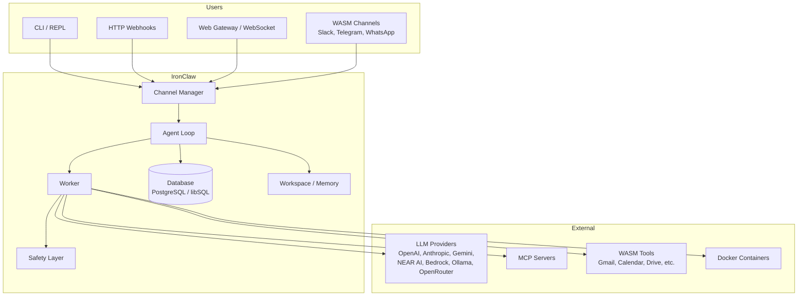
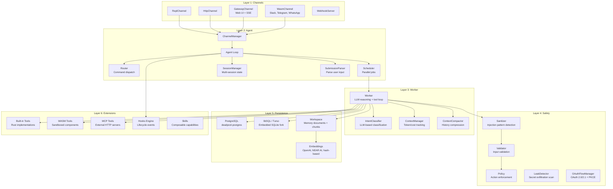
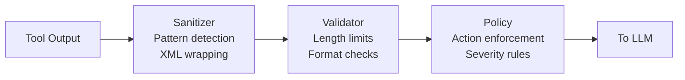
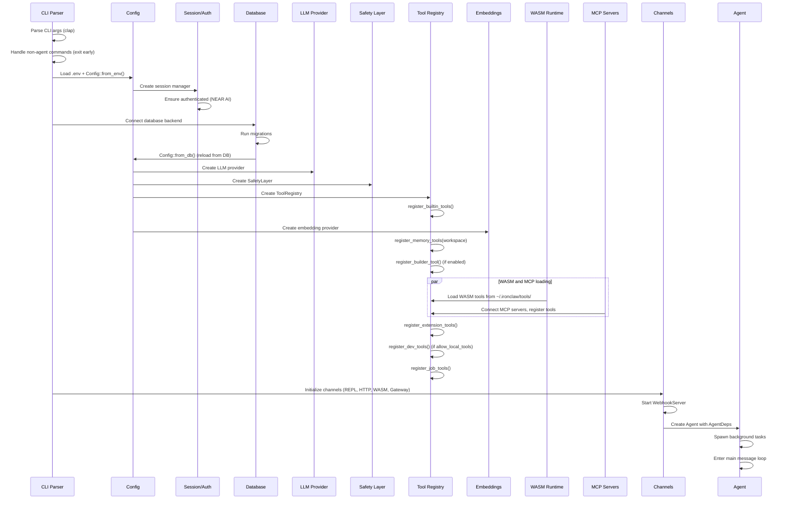
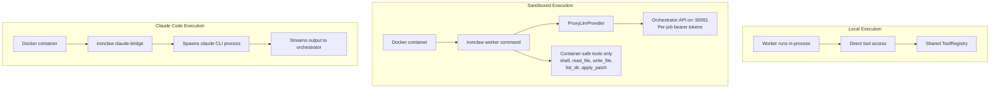

# IronClaw - System Architecture

**Version**: 0.1.0
**Last Updated**: 2026-02-22

---

## Table of Contents

1. [System Overview](#system-overview)
2. [Architecture Principles](#architecture-principles)
3. [System Context](#system-context)
4. [Component Architecture](#component-architecture)
5. [Key Traits](#key-traits)
6. [Startup Sequence](#startup-sequence)
7. [Job Execution Models](#job-execution-models)
8. [Background Systems](#background-systems)
9. [Key Design Decisions](#key-design-decisions)
10. [Testing Strategy](#testing-strategy)

---

## System Overview

IronClaw is a secure personal AI assistant built as a composable, trait-based system in Rust. It combines multi-channel input, LLM-driven reasoning, sandboxed tool execution, and persistent memory into a single autonomous agent framework.

### Key Statistics

| Metric | Value |
|--------|-------|
| Source Files | 247 Rust files |
| Lines of Code | ~122,000 lines |
| Public Modules | 30 |
| Tests | 1,973 |
| Rust Edition | 2024 (MSRV 1.92) |
| LLM Providers | 7 (NEAR AI, OpenAI, Anthropic, Gemini, Bedrock, Ollama, OpenRouter) |
| WASM Tools | 9 pre-built (Gmail, Calendar, Docs, Drive, Sheets, Slides, Okta, Slack, Telegram) |
| WASM Channels | 3 (Slack, Telegram, WhatsApp) |
| CLI Commands | 30+ subcommands |

### Module Distribution

| Module Group | Modules | Purpose |
|-------------|---------|---------|
| Core | `agent`, `config`, `context`, `error`, `worker`, `orchestrator` | Agent loop, routing, scheduling, configuration |
| I/O | `channels`, `llm`, `media` | Input channels, LLM providers, media processing |
| Persistence | `db`, `workspace`, `history`, `settings`, `secrets` | Dual-backend storage, memory, embeddings |
| Safety | `safety`, `sandbox` | Injection defense, leak detection, Docker sandboxing |
| Extensions | `tools`, `extensions`, `hooks`, `skills` | Tool registry, WASM/MCP tools, lifecycle hooks |
| Support | `cli`, `bootstrap`, `setup`, `pairing`, `estimation`, `evaluation`, `hot_reload`, `tracing_fmt`, `util`, `prelude` | CLI, onboarding, diagnostics |

---

## Architecture Principles

### 1. Composable Traits

Every major subsystem is defined by a trait (`Database`, `Channel`, `Tool`, `LlmProvider`, `EmbeddingProvider`). Implementations are swapped at runtime via `Arc<dyn Trait>`, enabling pluggable backends without recompilation.

### 2. Async-First

All I/O is async with Tokio. Shared state uses `Arc<T>` with `RwLock` for concurrent read/write access. Background tasks (heartbeat, self-repair, session pruning) run as spawned Tokio tasks.

### 3. Dual-Database

PostgreSQL (production) and libSQL/Turso (embedded/edge) share a single `Database` trait with ~91 async methods. Every new persistence feature must implement both backends.

### 4. Safety-by-Default

All external tool output passes through a three-stage safety pipeline (sanitizer, validator, policy) before reaching the LLM. Leak detection scans for secret exfiltration. Tools interacting with the filesystem or shell require explicit user approval.

### 5. Extensibility

Three tool types (built-in Rust, WASM sandboxed, MCP external) share the same `Tool` trait interface. Channels and hooks follow similar patterns. New capabilities can be added without modifying the core agent loop.

---

## System Context



### External Actors

1. **Users**: Interact via REPL, HTTP webhooks, Web Gateway (SSE/WebSocket), or WASM channels (Slack, Telegram, WhatsApp)
2. **LLM Providers**: 7 supported backends for reasoning and tool-use completions
3. **WASM Tools**: 9 pre-built sandboxed tools for Google Workspace, Slack, Telegram, Okta
4. **MCP Servers**: External tool servers discovered via Model Context Protocol
5. **Databases**: PostgreSQL or libSQL for all persistence
6. **Docker**: Sandboxed containers for filesystem/shell operations

---

## Component Architecture

### Layered Design



### Layer 1: Channels (`src/channels/`)

Channels provide input streams to the agent. All implement the `Channel` trait, returning a `MessageStream` of `IncomingMessage` values.

| Channel | Source | Transport |
|---------|--------|-----------|
| `ReplChannel` | `src/channels/repl.rs` | stdin/stdout interactive terminal |
| `HttpChannel` | `src/channels/http.rs` | HTTP POST webhooks |
| `GatewayChannel` | `src/channels/web/` | Web UI with SSE streaming, auth tokens |
| `WasmChannel` | `src/channels/wasm/` | WASM components via WIT interface |
| `WebhookServer` | `src/channels/webhook.rs` | Unified axum server hosting all HTTP routes |

The `ChannelManager` merges all channel streams into a single `select_all` stream consumed by the agent loop.

### Layer 2: Agent (`src/agent/`)

The agent loop is the central coordinator:

1. **SubmissionParser** parses incoming messages, resolving sessions and threads
2. **Router** handles explicit `/` commands (e.g., `/status`, `/cancel`, `/help`)
3. **IntentClassifier** uses the LLM to classify natural language into `MessageIntent` variants
4. **Scheduler** dispatches jobs to workers with parallel execution support
5. **SessionManager** maintains per-user, per-channel session state with thread isolation

Key files:
- `src/agent/agent_loop.rs` -- `Agent` struct and main `run()` loop
- `src/agent/router.rs` -- Command prefix routing
- `src/agent/scheduler.rs` -- `Scheduler` with job/subtask tracking
- `src/agent/session.rs` -- `Session` and `ThreadState`
- `src/agent/submission.rs` -- `SubmissionParser` and `Submission` types

### Layer 3: Worker (`src/worker/`)

The worker executes a reasoning-and-action loop:

1. Build system prompt with identity files, tool definitions, and context
2. Send conversation to LLM with tool definitions
3. If LLM requests tool calls, execute them through the safety layer
4. Feed sanitized tool results back to the LLM
5. Repeat until the LLM produces a final text response or iteration limit is reached

Three execution modes exist (see [Job Execution Models](#job-execution-models)).

### Layer 4: Safety (`src/safety/`)

All external data flows through a three-stage pipeline before reaching the LLM:



Key subsystems:
- **Sanitizer**: Detects prompt injection patterns, wraps outputs in XML markers
- **Validator**: Enforces length limits and format constraints
- **Policy**: Configurable rules with severity levels and actions (allow, warn, block)
- **LeakDetector**: Scans outputs for secret patterns (API keys, tokens, passwords)
- **LogRedactor**: Strips credentials from log output
- **OAuthFlowManager**: OAuth 2.0/2.1 + PKCE flows for external service authentication
- **GroupPolicyManager**: Per-group access control lists
- **ElevatedMode**: Session-bound privilege escalation

### Layer 5: Persistence (`src/db/`, `src/workspace/`)

The `Database` trait (~91 async methods) covers conversations, jobs, settings, memory documents, chunks, embeddings, secrets, hooks, routines, and more. Two feature-gated backends:

| Backend | Feature Flag | Use Case |
|---------|-------------|----------|
| PostgreSQL | `postgres` (default) | Production, full FTS + vector search |
| libSQL/Turso | `libsql` | Embedded, edge, local development |

Key type mappings for libSQL: `UUID` to `TEXT`, `TIMESTAMPTZ` to `TEXT (ISO-8601)`, `JSONB` to `TEXT`, `VECTOR(1536)` to `F32_BLOB(1536)`, `tsvector` to `FTS5`.

The **Workspace** (`src/workspace/`) provides filesystem-like persistent memory:
- `memory_documents` + `memory_chunks` tables
- Identity files (IDENTITY.md, SOUL.md, AGENTS.md, USER.md) injected into LLM system prompts
- Hybrid search via FTS + vector with Reciprocal Rank Fusion (PostgreSQL) or FTS5-only (libSQL)
- Connections (typed relationships forming a knowledge graph)
- Spaces (named collections for organizing memories)
- Profiles (auto-maintained fact profiles for personalization)

### Layer 6: Extensions (`src/tools/`, `src/extensions/`, `src/hooks/`, `src/skills/`)

Three tool types share the `Tool` trait:

| Type | Location | Execution |
|------|----------|-----------|
| Built-in | `src/tools/builtin/` | In-process Rust |
| WASM | `~/.ironclaw/tools/` | Sandboxed wasmtime component |
| MCP | External servers | HTTP transport |

The `ToolRegistry` registers tools in phases: `register_builtin_tools()`, `register_dev_tools()`, `register_memory_tools()`, `register_job_tools()`, `register_extension_tools()`, `register_builder_tool()`.

**Hooks** (`src/hooks/`) provide lifecycle event interception:
- Types: `beforeInbound`, `beforeOutbound`, `beforeToolCall`, `onSessionStart`, `onSessionEnd`, `transformResponse`, `transcribeAudio`
- Actions: shell, HTTP, inline, webhook
- 8 bundled hooks (profanity filter, rate limit guard, sensitive data redactor, etc.)
- Outbound webhooks with HMAC-SHA256 signatures and retry

---

## Key Traits

### Database (`src/db/mod.rs`)

```rust
#[async_trait]
pub trait Database: Send + Sync {
    async fn run_migrations(&self) -> Result<(), DatabaseError>;

    // Conversations (~5 methods)
    async fn create_conversation(&self, channel: &str, user_id: &str, thread_id: Option<&str>) -> Result<Uuid, DatabaseError>;

    // Jobs (~10 methods)
    async fn create_job(&self, ...) -> Result<Uuid, DatabaseError>;
    async fn update_job_state(&self, id: Uuid, state: JobState) -> Result<(), DatabaseError>;

    // Memory (~15 methods)
    async fn upsert_memory_document(&self, ...) -> Result<(), WorkspaceError>;
    async fn hybrid_search(&self, ...) -> Result<Vec<SearchResult>, WorkspaceError>;

    // Settings, Secrets, Hooks, Routines, etc.
    // ~91 total async methods
}
```

### Channel (`src/channels/channel.rs`)

```rust
#[async_trait]
pub trait Channel: Send + Sync {
    fn name(&self) -> &str;
    async fn start(&self) -> Result<MessageStream, ChannelError>;
    async fn send(&self, response: OutgoingResponse) -> Result<(), ChannelError>;
    async fn send_status(&self, update: StatusUpdate) -> Result<(), ChannelError>;
}
```

### Tool (`src/tools/tool.rs`)

```rust
#[async_trait]
pub trait Tool: Send + Sync {
    fn name(&self) -> &str;
    fn description(&self) -> &str;
    fn parameters_schema(&self) -> serde_json::Value;
    async fn execute(&self, params: serde_json::Value, ctx: &JobContext) -> Result<ToolOutput, ToolError>;
    fn estimated_cost(&self, params: &serde_json::Value) -> Option<Decimal> { None }
    fn estimated_duration(&self, params: &serde_json::Value) -> Option<Duration> { None }
    fn requires_sanitization(&self) -> bool { true }
    fn requires_approval(&self) -> bool { false }
    fn domain(&self) -> ToolDomain { ToolDomain::Orchestrator }
}
```

### LlmProvider (`src/llm/provider.rs`)

```rust
#[async_trait]
pub trait LlmProvider: Send + Sync {
    fn model_name(&self) -> &str;
    fn cost_per_token(&self) -> (Decimal, Decimal);
    async fn complete(&self, request: CompletionRequest) -> Result<CompletionResponse, LlmError>;
    async fn complete_with_tools(&self, request: ToolCompletionRequest) -> Result<ToolCompletionResponse, LlmError>;
    async fn list_models(&self) -> Result<Vec<String>, LlmError> { Ok(vec![]) }
    async fn model_metadata(&self) -> Result<ModelMetadata, LlmError>;
    fn active_model_name(&self) -> String { self.model_name().to_string() }
    fn set_model(&self, model: &str) -> Result<(), LlmError>;
}
```

### EmbeddingProvider (`src/workspace/embeddings.rs`)

```rust
#[async_trait]
pub trait EmbeddingProvider: Send + Sync {
    async fn embed(&self, texts: &[String]) -> Result<Vec<Vec<f32>>, EmbeddingError>;
    fn dimensions(&self) -> usize;
    fn model_name(&self) -> &str;
}
```

### Additional Traits

| Trait | Location | Purpose |
|-------|----------|---------|
| `SuccessEvaluator` | `src/evaluation/success.rs` | Evaluate job outcomes |
| `TtsProvider` | `src/media/tts.rs` | Text-to-speech synthesis |
| `TranscriptionProvider` | `src/media/transcription.rs` | Audio-to-text transcription |
| `VisionProvider` | `src/media/vision.rs` | Image understanding |

---

## Startup Sequence



Non-agent CLI commands (`tool`, `config`, `mcp`, `memory`, `pairing`, `status`, `doctor`, `gateway`, `sessions`, `hooks`, `cron`, `logs`, `message`, `channels`, `plugins`, `webhooks`, `skills`, `agents`, `nodes`, `browser`, `completion`, `update`) exit early with minimal setup.

---

## Job Execution Models



### Job State Machine

```
Pending --> InProgress --> Completed --> Submitted --> Accepted
   |            |
   |            +--> Failed
   |            |
   |            +--> Stuck --> InProgress (self-repair recovery)
   |
   +--> Failed
```

### Local

The worker runs in the same process as the agent. It has direct access to the full `ToolRegistry`, `SafetyLayer`, and `Database`. This is the default mode when sandboxing is disabled.

### Sandboxed

When `sandbox.enabled = true`, filesystem and shell operations run inside Docker containers. The container runs `ironclaw worker --job-id <UUID> --orchestrator-url http://host:50051`. Inside the container:
- **ProxyLlmProvider** routes all LLM calls through the orchestrator's HTTP API
- Only container-safe tools are available (shell, read_file, write_file, list_dir, apply_patch)
- **WorkerHttpClient** reports status and completion back to the orchestrator
- Communication is authenticated with per-job bearer tokens managed by `TokenStore`

### Claude Code

A specialized sandbox mode where the container runs `ironclaw claude-bridge`, which spawns the `claude` CLI process. The bridge streams Claude Code's output back to the orchestrator, enabling the agent to delegate complex coding tasks.

---

## Background Systems

The agent spawns several background tasks alongside the main message loop:

### Self-Repair (`src/agent/self_repair.rs`)

Periodically scans for stuck jobs (no progress within a timeout) and broken tools. Recovery strategies include restarting jobs, marking them as failed, and disabling flaky tools.

### Session Pruning (`src/agent/session_pruning.rs`)

Cleans up expired and idle sessions based on configurable TTL and idle thresholds. Prevents unbounded memory growth from abandoned sessions.

### Heartbeat (`src/agent/heartbeat.rs`)

Proactive periodic execution driven by the `HEARTBEAT.md` checklist file in the workspace. Enables the agent to perform scheduled maintenance tasks without user input.

### Routine Engine (`src/agent/routine_engine.rs`)

Cron-based and event-driven scheduled job execution. Routines are stored in the database with cron expressions, and the engine spawns jobs at the appropriate times.

### Context Monitor (`src/agent/context_monitor.rs`)

Tracks token usage, elapsed time, and cost for active jobs. Enforces budget limits and triggers context compaction when the conversation exceeds token thresholds.

### Config Reload (`src/agent/config_reload.rs`)

Watches the filesystem for configuration changes and broadcasts notifications to running components via `HotReloadConfig<Config>`.

---

## Key Design Decisions

### 1. Why Dual Database Backends?

**Decision**: Support both PostgreSQL and libSQL behind a unified trait.

**Rationale**:
- PostgreSQL provides production-grade FTS, vector search, and connection pooling
- libSQL enables embedded/edge deployment with zero external dependencies
- The unified `Database` trait (with ~75 methods) ensures feature parity

**Trade-off**: Every new persistence feature requires two implementations and careful type mapping (UUID to TEXT, JSONB to TEXT, VECTOR to F32_BLOB, etc.).

### 2. Why Three Tool Types?

**Decision**: Built-in (Rust), WASM (sandboxed), and MCP (external) tools all share the `Tool` trait.

**Rationale**:
- Built-in tools have zero overhead and full access to agent internals
- WASM tools run in a sandboxed wasmtime environment with capability-based permissions
- MCP tools connect to external servers, enabling third-party integrations
- The shared trait means the worker loop is agnostic to tool implementation

### 3. Why Safety-by-Default?

**Decision**: All external tool output is sanitized before reaching the LLM, with no opt-out.

**Rationale**:
- Prompt injection through tool outputs is a critical threat vector
- The three-stage pipeline (sanitize, validate, policy) provides defense in depth
- Leak detection prevents the LLM from exfiltrating secrets in responses

### 4. Why Docker Sandboxing for Shell/File Tools?

**Decision**: Shell commands and file operations run inside Docker containers by default.

**Rationale**:
- Direct filesystem access from an LLM-driven agent is a high-risk surface
- Container isolation limits blast radius (memory limits, CPU shares, network restrictions)
- The ProxyLlmProvider pattern keeps the LLM API key out of the container
- Per-job bearer tokens prevent cross-job interference

### 5. Why WASM for Channels?

**Decision**: Channels can be implemented as WASM components following a WIT interface.

**Rationale**:
- Pluggable without recompilation of the main binary
- Sandboxed execution prevents channel code from compromising the host
- Credentials injected by the host, never embedded in the WASM component
- Build once, deploy anywhere (wasmtime cross-platform support)

---

## Testing Strategy

### Test Organization

Tests live in `mod tests {}` blocks at the bottom of each source file. No separate test directories.

```bash
cargo test                                # Run all 1,973 tests
cargo test test_name                      # Run a specific test
cargo test safety::sanitizer::tests       # Run a module's tests
```

### Test Conventions

- Async tests use `#[tokio::test]`
- Feature-gated tests: `#[cfg(all(test, feature = "postgres"))]` for PostgreSQL-specific, `#[cfg(test)]` for feature-independent
- No mocks -- prefer real implementations or stubs
- Environment variable tests require `unsafe` blocks (Rust 2024 edition)

### CI Pipeline

| Workflow | Trigger | What It Checks |
|----------|---------|----------------|
| `test.yml` | PR, push | `cargo test` (excludes PostgreSQL integration tests) |
| `code_style.yml` | PR, push | `cargo fmt --check` + `cargo clippy` |
| `release.yml` | Tag | Cross-platform release builds via `cargo-dist` |
| `release-plz.yml` | Push | Automated version bumping and changelog |
| `windows-installer.yml` | Release | PowerShell installer upload |

Target platforms: `aarch64-apple-darwin`, `aarch64-unknown-linux-gnu`, `x86_64-apple-darwin`, `x86_64-unknown-linux-gnu`, `x86_64-pc-windows-msvc`.
