# IronClaw - Data Flow Documentation

**Last Updated**: 2026-02-22

---

## Table of Contents

1. [Overview](#overview)
2. [Message Processing Flow](#message-processing-flow)
3. [Tool Execution Flow](#tool-execution-flow)
4. [LLM Request Flow](#llm-request-flow)
5. [Safety Pipeline Flow](#safety-pipeline-flow)
6. [Channel I/O Flow](#channel-io-flow)
7. [Job Lifecycle](#job-lifecycle)
8. [Startup Sequence](#startup-sequence)
9. [WASM Tool/Channel Flow](#wasm-toolchannel-flow)
10. [Workspace/Memory Flow](#workspacememory-flow)
11. [Hook Execution Flow](#hook-execution-flow)

---

## Overview

Data flows through IronClaw in a layered, event-driven architecture. Messages enter through Channels, pass through the Agent loop for parsing and routing, are dispatched to Workers for LLM reasoning and tool execution, and flow back out through the same channel. All tool outputs pass through the Safety layer before reaching the LLM.

```
+-------------------------------------------------------------------+
|  Channels (REPL, HTTP, WebSocket, WASM, Web Gateway)              |
+---------------------------------+---------------------------------+
                                  |
                                  v
+---------------------------------+---------------------------------+
|  ChannelManager (merges all input streams via select_all)         |
+---------------------------------+---------------------------------+
                                  |
                                  v
+---------------------------------+---------------------------------+
|  Agent Loop                                                       |
|  +------------------+  +------------------+  +-----------------+  |
|  | SubmissionParser |->| SessionManager   |->| Router          |  |
|  +------------------+  +------------------+  +-----------------+  |
+---------------------------------+---------------------------------+
                                  |
                                  v
+---------------------------------+---------------------------------+
|  Scheduler (parallel job dispatch via tokio tasks)                |
+---------------------------------+---------------------------------+
                                  |
                                  v
+---------------------------------+---------------------------------+
|  Worker (LLM reasoning + tool execution loop)                     |
|  +-------------+  +-------------+  +----------------------------+ |
|  | Reasoning   |->| ToolRegistry|->| SafetyLayer                | |
|  | (LLM calls) |  | (execute)   |  | (sanitize -> validate ->   | |
|  |             |  |             |  |  policy -> leak detection)  | |
|  +-------------+  +-------------+  +----------------------------+ |
+---------------------------------+---------------------------------+
                                  |
                                  v
+---------------------------------+---------------------------------+
|  Persistence Layer                                                |
|  +----------+  +-----------+  +--------------------------------+  |
|  | Database |  | Workspace |  | SecretsStore                   |  |
|  | (PG/     |  | (memory   |  | (encrypted credential storage) |  |
|  |  libSQL) |  |  + search)|  |                                |  |
|  +----------+  +-----------+  +--------------------------------+  |
+-------------------------------------------------------------------+
```

---

## Message Processing Flow

The core request path from channel input to agent response.

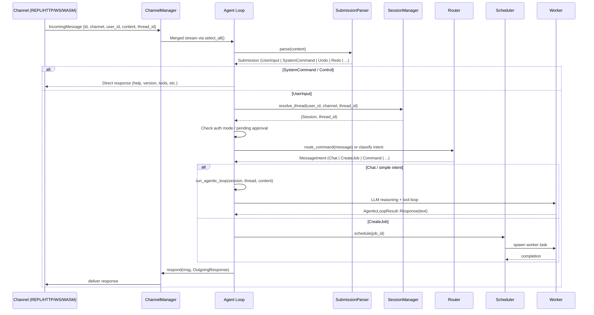

### Submission Types

`SubmissionParser::parse()` converts raw text into typed submissions:

| Submission | Trigger | Behavior |
|------------|---------|----------|
| `UserInput` | Any non-command text | Enters agentic loop |
| `SystemCommand` | `/help`, `/tools`, `/model`, `/debug`, `/ping` | Direct response, no LLM |
| `Undo` / `Redo` | `/undo`, `/redo` | Roll back / replay turns |
| `Interrupt` | `/interrupt`, `/stop` | Cancel current turn |
| `Compact` | `/compact` | Summarize old turns to save context |
| `Heartbeat` | `/heartbeat` | Trigger heartbeat check |
| `Quit` | `/quit`, `/exit` | Shutdown signal |
| `NewThread` | `/thread new`, `/new` | Create fresh conversation thread |
| `SwitchThread` | `/thread <uuid>` | Switch to existing thread |
| `ApprovalResponse` | `y`, `n`, `a` (yes/no/always) | Tool approval gate |

### Session Resolution

`SessionManager` maps external identifiers to internal UUIDs:

```
ThreadKey { user_id, channel, external_thread_id }
    -> lookup thread_map (RwLock<HashMap>)
    -> if found: return (Session, thread_id)
    -> if not: create Session + Thread, store mapping, return
```

Sessions contain threads, which contain turns (request/response pairs). Each thread maintains its own conversation history and undo stack.

---

## Tool Execution Flow

The Worker runs an iterative LLM reasoning loop. Each iteration may produce tool calls that need execution and safety processing.

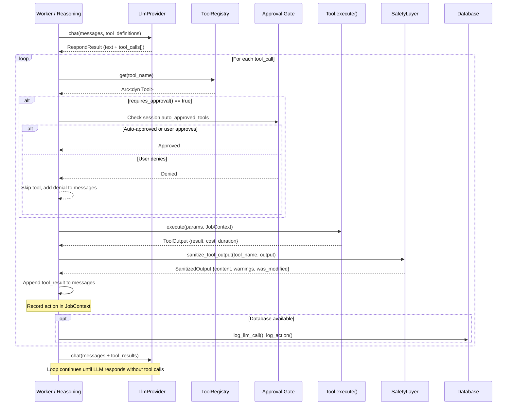

### Tool Types

All three tool types implement the same `Tool` trait:

| Type | Location | Sandbox | Examples |
|------|----------|---------|----------|
| **Built-in** (Rust) | `src/tools/builtin/` | In-process | shell, read_file, write_file, memory_search |
| **WASM** (sandboxed) | `~/.ironclaw/tools/` | Fuel-limited WASM | gmail, slack, google-calendar |
| **MCP** (external) | HTTP transport | External process | Any MCP-compatible server |

### Approval Gate

Tools with `requires_approval() = true` (shell, http, write_file, apply_patch, build_software) are gated:

1. Check if tool is in `session.auto_approved_tools` -- if so, skip prompt
2. Send `StatusUpdate::ApprovalNeeded` to channel
3. Thread state transitions to `WaitingForApproval`
4. Next user input is parsed as `ApprovalResponse` (y/n/a)
5. "Always approve" (`a`) adds tool to session's `auto_approved_tools` set

---

## LLM Request Flow

The LLM subsystem supports 8 backends with automatic failover.

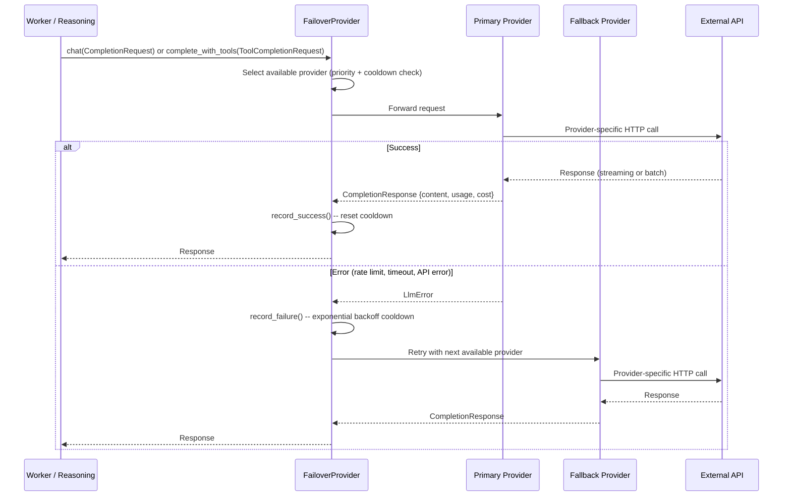

### Provider Selection

```
For each request:
    1. Sort providers by priority (lower = higher priority)
    2. Filter out providers in cooldown (cooldown_until > now)
    3. Try first available provider
    4. On failure: cooldown = base_cooldown * 2^(consecutive_failures - 1), capped at 5min
    5. Try next provider
    6. After max_retries (default 3), return error
```

### Supported Backends

| Backend | Auth | Transport |
|---------|------|-----------|
| NEAR AI (Responses API) | Session-based | HTTP |
| NEAR AI (Chat Completions) | API key | HTTP |
| OpenAI | API key | rig-core adapter |
| Anthropic | API key | rig-core adapter |
| Google Gemini | API key | Custom HTTP |
| AWS Bedrock | SigV4 | Custom HTTP |
| Ollama | None (local) | rig-core adapter |
| OpenRouter | API key | Custom HTTP |

---

## Safety Pipeline Flow

All external tool output passes through the `SafetyLayer` before reaching the LLM context.

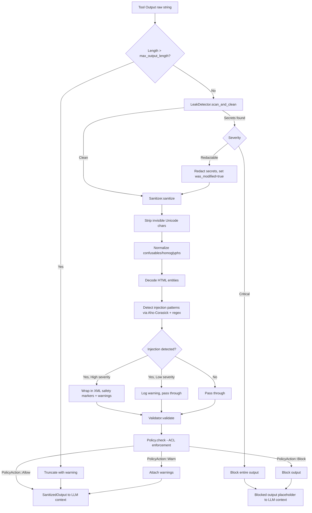

### Safety Components

| Component | File | Purpose |
|-----------|------|---------|
| `Sanitizer` | `safety/sanitizer.rs` | Prompt injection detection via pattern matching (Aho-Corasick), Unicode normalization, HTML entity decoding |
| `Validator` | `safety/validator.rs` | Content validation rules |
| `Policy` | `safety/policy.rs` | ACL enforcement, block/warn/allow actions |
| `LeakDetector` | `safety/leak_detector.rs` | Secret exfiltration scanning and redaction |
| `LogRedactor` | `safety/log_redaction.rs` | Credential redaction in logs |
| `OAuthFlowManager` | `safety/oauth.rs` | OAuth 2.0/2.1 + PKCE flow management |
| `GroupPolicyManager` | `safety/group_policies.rs` | Per-group ACL policies |

---

## Channel I/O Flow

Channels are pluggable input/output adapters implementing the `Channel` trait.

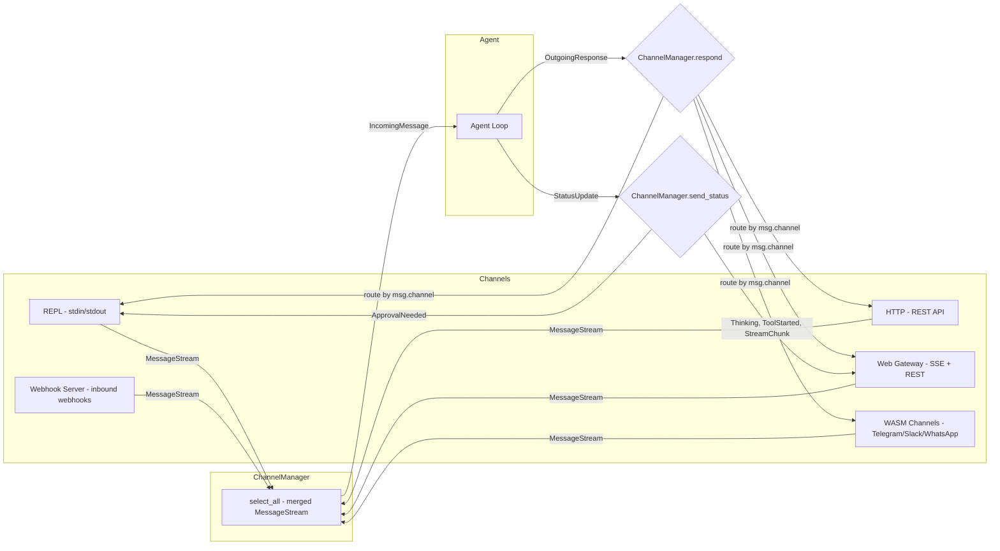

### Channel Trait

```rust
trait Channel: Send + Sync {
    fn name(&self) -> &str;
    async fn start(&self) -> Result<MessageStream, ChannelError>;
    async fn respond(&self, msg: &IncomingMessage, response: OutgoingResponse) -> Result<()>;
    async fn send_status(&self, status: StatusUpdate, metadata: &Value) -> Result<()>;
    async fn broadcast(&self, user_id: &str, response: OutgoingResponse) -> Result<()>;
    async fn health_check(&self) -> Result<()>;
    async fn shutdown(&self) -> Result<()>;
}
```

### Message Types

| Type | Direction | Fields |
|------|-----------|--------|
| `IncomingMessage` | Channel -> Agent | id, channel, user_id, user_name, content, thread_id, received_at, metadata |
| `OutgoingResponse` | Agent -> Channel | content, thread_id, metadata |
| `StatusUpdate` | Agent -> Channel | Thinking, ToolStarted, ToolCompleted, ToolResult, StreamChunk, ApprovalNeeded, AuthRequired, JobStarted |

---

## Job Lifecycle

Jobs follow a state machine through their execution lifecycle.

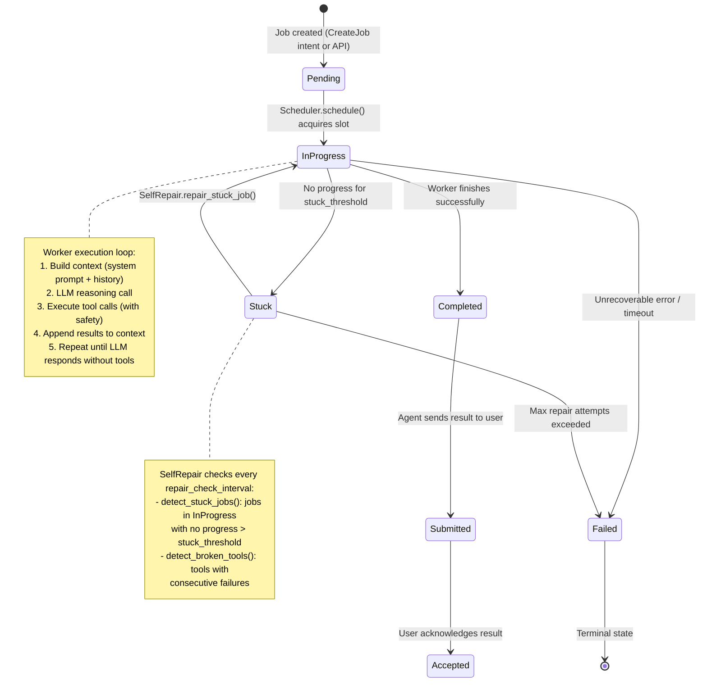

### Execution Models

| Model | Environment | Communication | Tools |
|-------|-------------|---------------|-------|
| **Local** | In-process worker | Direct function calls | All registered tools |
| **Sandboxed** | Docker container with `ironclaw worker` | HTTP to orchestrator on `:50051` | Container-safe only (shell, read_file, write_file, list_dir, apply_patch) |
| **Claude Code** | Docker container with `ironclaw claude-bridge` | HTTP to orchestrator, spawns `claude` CLI | Claude's built-in tools |

### Sandboxed Worker Communication

```
Docker Container                         Host (Orchestrator)
+-----------------------------+          +-------------------------+
| ironclaw worker             |          | OrchestratorApi :50051  |
|   ProxyLlmProvider ---------|--HTTP--->| /worker/{id}/llm/complete
|   WorkerHttpClient ---------|--HTTP--->| /worker/{id}/status     |
|                             |          | /worker/{id}/events     |
|   ToolRegistry (container)  |          | /worker/{id}/job        |
|   SafetyLayer               |          | TokenStore (per-job JWT)|
+-----------------------------+          +-------------------------+
```

---

## Startup Sequence

The full agent startup from `main.rs`.

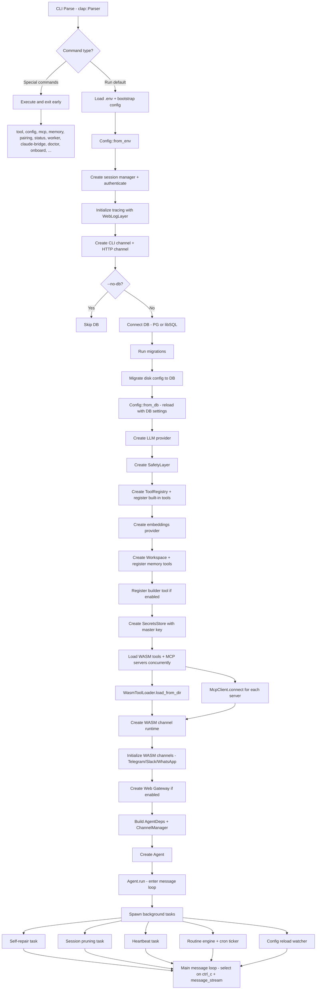

### Configuration Priority

```
Environment variables (highest)
    > Database settings table (per-agent)
    > Bootstrap config (~/.ironclaw/bootstrap.json)
    > Compiled defaults (lowest)
```

---

## WASM Tool/Channel Flow

WASM components run in sandboxed wasmtime instances with fuel-limited execution.

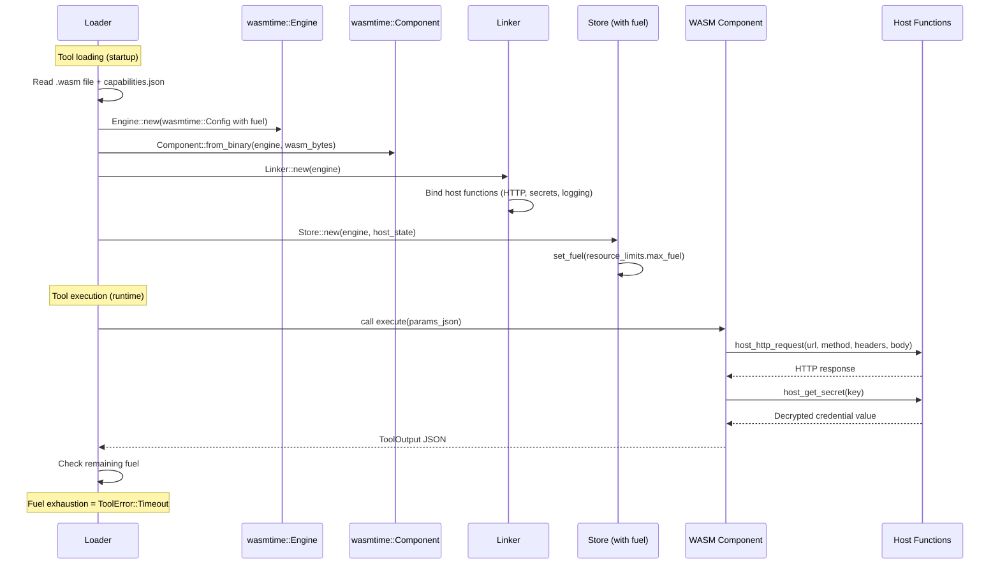

### WASM Channel Lifecycle

```
1. WasmChannelLoader scans channels-src/ build artifacts
2. For each .wasm + capabilities.json:
   a. Create WasmChannelRuntime with shared Engine
   b. Bind WIT interface (wit/channel.wit) host functions
   c. Call channel.start() -> MessageStream
   d. Register HTTP endpoints in WasmChannelRouter (axum)
3. Router mounts /channels/{name}/webhook for inbound webhooks
4. Messages flow through SharedWasmChannel -> ChannelManager
```

---

## Workspace/Memory Flow

The Workspace provides persistent, searchable memory using a filesystem-like API backed by the database.

### Write Path

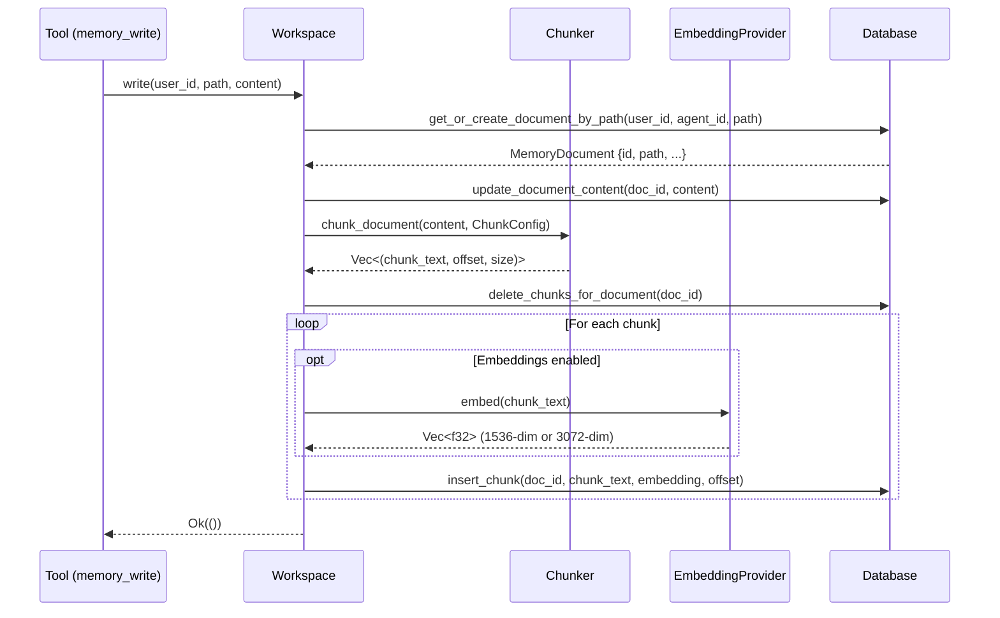

### Read Path (Hybrid Search)

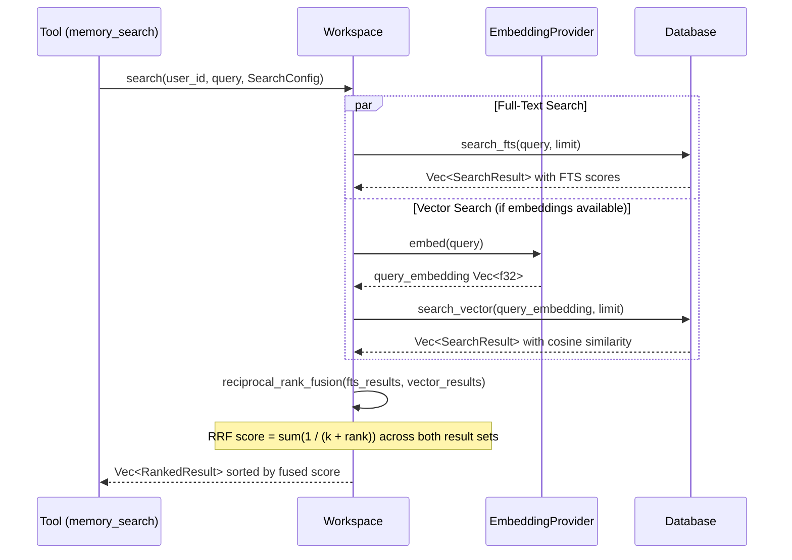

### Storage Details by Backend

| Feature | PostgreSQL | libSQL |
|---------|-----------|--------|
| Full-text search | `tsvector` + `ts_rank` | FTS5 virtual tables |
| Vector search | `pgvector` extension (`VECTOR(1536)`) | `F32_BLOB(1536)` with cosine distance |
| UUID storage | Native `UUID` type | `TEXT` (string representation) |
| Timestamps | `TIMESTAMPTZ` | `TEXT` (ISO-8601) |
| JSON | `JSONB` | `TEXT` (serialized) |

### Memory Features

- **Documents**: Markdown files in a hierarchical path structure
- **Chunks**: Documents split into overlapping chunks for granular search
- **Connections**: Typed relationships between documents (updates, extends, derives) forming a knowledge graph
- **Spaces**: Named collections for organizing memories by topic/project
- **Profiles**: Auto-maintained fact profiles (static/dynamic) for personalization
- **Identity files**: IDENTITY.md, SOUL.md, AGENTS.md, USER.md injected into LLM system prompts

---

## Hook Execution Flow

Lifecycle hooks intercept events at various points in the processing pipeline.

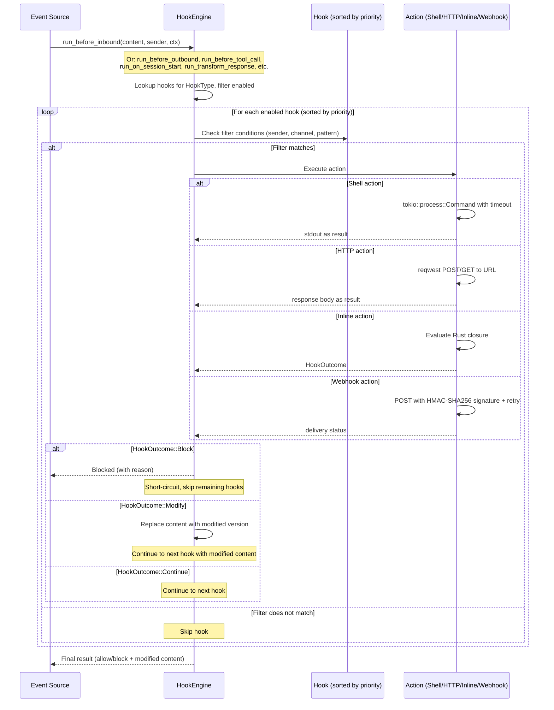

### Hook Types

| Hook Type | Trigger Point | Can Modify | Can Block |
|-----------|---------------|------------|-----------|
| `beforeInbound` | Before message enters agent loop | Content | Yes |
| `beforeOutbound` | Before response sent to channel | Content | Yes |
| `beforeToolCall` | Before tool execution | Parameters | Yes |
| `onSessionStart` | New session created | No | No |
| `onSessionEnd` | Session closed | No | No |
| `transformResponse` | After LLM response, before delivery | Content | No |
| `transcribeAudio` | Audio input received | Transcription | No |

### Bundled Hooks

8 built-in hooks: `profanity_filter`, `rate_limit_guard`, `sensitive_data_redactor`, `audit_logger`, `input_validator`, `response_formatter`, `cost_tracker`, `notification_forwarder`.

### Outbound Webhooks

Outbound webhook actions sign payloads with HMAC-SHA256 and include automatic retry with exponential backoff. The payload includes the event type, content, timestamp, and hook metadata.
